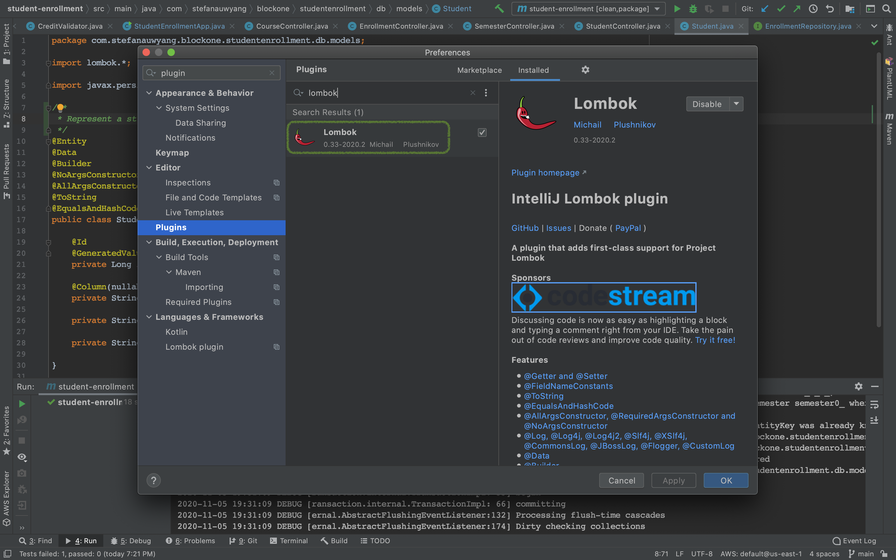
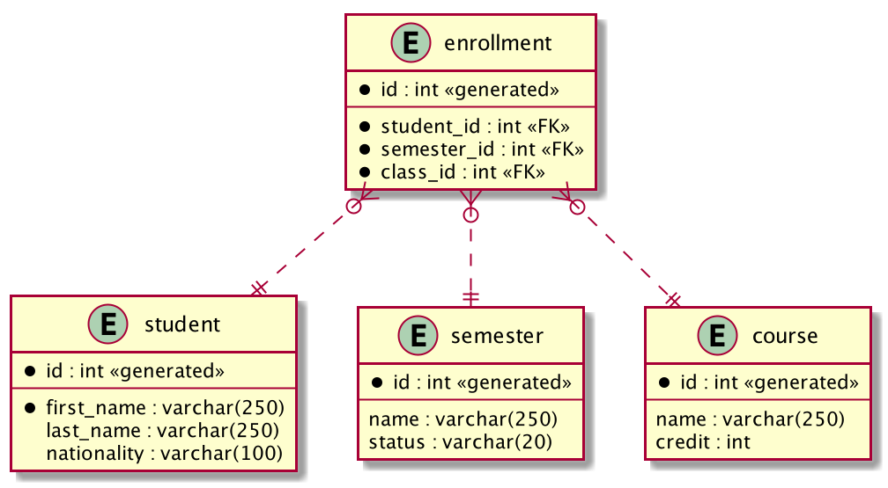
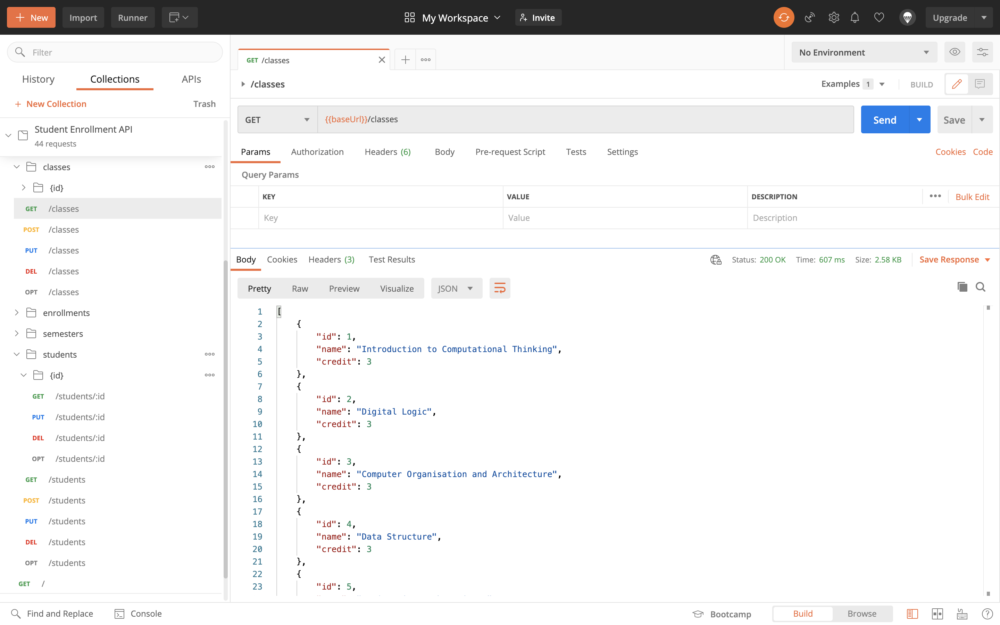

# Student Enrollment REST API
REST API class enrollment system built using Javba, Spring Boot, H2 in memory data structure.

## Development requirement
1. JDK 1.8 or above
2. IntellJ or Eclipse editor with Lombok plug-in installed



## Important guidelines
1. This application developed using lombok for cleaner code (e.g. auto generate setter getter). 
You need lombok plug-in in your editor if not yet installed.
2. To build and run application: mvn spring-boot:run
3. To generate documentation run: mvn javadoc:javadoc
4. Test cases created to cover code align with requirement

## Database Structure
Class and Course are used interchange in the code, but API interface always use class.



## Requirement
1. The users of the system will consist of both school administrators and students.
2. School administrators will create student identities
3. Students will be able to enroll themselves into classes before each semester.

## Constraints:
1. School administrators can create and modify student records but never delete them.
API designed for generic use. Hence, access control and design decision not to allow deletion controlled in Front End.
2. Students will be able to enroll themselves into classes before each term.
API designed for generic use. Hence, access control and design decision to allow student to enroll himself
controlled in Front End.
3. Each class a fixed credit/unit. Some harder classes might be 4 credits while easier ones could be 2 or 3 credits.
4. ach student is only allowed to be enrolled in a maximum of 20 credits for each semester.  
There is a minimum of 10 credits to be considered full time.

## Swagger documentation to try out via Postman
This API available on API Gateway with CI/CD, [Swagger documentation](swagger.yaml) available for Postman testing



### Create student
Request: POST /students
```json
{
    "firstName": "Mike",
    "lastName": "Wong",
    "nationality": "Myanmar"
}
```
Response:
```json
{
    "id": 1,
    "firstName": "Mike",
    "lastName": "Wong",
    "nationality": "Myanmar"
}
```

### Modify student
Request: PUT /students
```json
{
    "id": 1,
    "firstName": "Michael",
    "lastName": "Wong",
    "nationality": "Malaysia"
}
```
Response
```json
{
    "id": 1,
    "firstName": "Michael",
    "lastName": "Wong",
    "nationality": "Malaysia"
}
```

### Enroll student to a class in a semester
Request: POST /enrollments
```json
{
    "student_id": 2,
    "semester_id": 4,
    "class_id": 7
}
```
Response:
```json
{
    "id": 1,
    "student_id": 2,
    "semester_id": 4,
    "class_id": 7
}
```

### Enroll student to a class in a semester without request body
Request: POST /enrollments/semesters/4/classes/7/students/2/enroll

Response:
```json
{
    "id": 1,
    "student_id": 2,
    "semester_id": 4,
    "class_id": 7
}
```

### Obtaining Student Data
Request: GET /students

Response:
```json
[
  {
    "id": 1,
    "nationality": "Malaysia",
    "first_name": "Michael",
    "last_name": "Wong"
  },
  {
    "id": 2,
    "nationality": "Singapore",
    "first_name": "Sylvia",
    "last_name": "Lim"
  },
  {
    "id": 3,
    "nationality": "Indonesia",
    "first_name": "Anastasia",
    "last_name": "Potter"
  },
  {
    "id": 4,
    "nationality": "U.S.A",
    "first_name": "James",
    "last_name": "Lim"
  }
]
```

Request: GET /students?last_name=lim

Response:
```json
[
  {
    "id": 2,
    "nationality": "Singapore",
    "first_name": "Sylvia",
    "last_name": "Lim"
  },
  {
    "id": 4,
    "nationality": "U.S.A",
    "first_name": "James",
    "last_name": "Lim"
  }
]
```

### Obtaining Semester Data
Request: GET /semesters?status=open

Response:
```json
[
  {
    "id": 9,
    "name": "2021-1",
    "status": "OPEN"
  },
  {
    "id": 10,
    "name": "2021-2",
    "status": "OPEN"
  }
]
```

### Obtaining Class Data
Request: GET /classes

Response:
```json
[
  {
    "id": 1,
    "name": "Introduction to Computational Thinking",
    "credit": 3
  },
  {
    "id": 2,
    "name": "Digital Logic",
    "credit": 3
  },
  {
    "id": 3,
    "name": "Computer Organisation and Architecture",
    "credit": 3
  },
  {
    "id": 4,
    "name": "Data Structure",
    "credit": 3
  },
  {
    "id": 5,
    "name": "Engineering Mathematics 1",
    "credit": 3
  },
  {
    "id": 6,
    "name": "Engineering Mathematics 2",
    "credit": 3
  },
  {
    "id": 7,
    "name": "Physics for Computing",
    "credit": 2
  },
  {
    "id": 8,
    "name": "Algorithms",
    "credit": 3
  },
  {
    "id": 9,
    "name": "Objet Oriented Design & Programming",
    "credit": 3
  },
  {
    "id": 10,
    "name": "Computer Graphics & Visualization",
    "credit": 3
  },
  {
    "id": 11,
    "name": "Human‐Computer Interaction",
    "credit": 3
  },
  {
    "id": 12,
    "name": "Operating Systems",
    "credit": 3
  },
  {
    "id": 13,
    "name": "Software Engineering",
    "credit": 3
  },
  {
    "id": 14,
    "name": "Introduction to Databases",
    "credit": 3
  },
  {
    "id": 15,
    "name": "Introduction to Data Science",
    "credit": 3
  },
  {
    "id": 16,
    "name": "Advanced Computer Architecture",
    "credit": 3
  },
  {
    "id": 17,
    "name": "Advanced Software Engineering",
    "credit": 3
  },
  {
    "id": 18,
    "name": "Artificial Intelligence ‐ Problem Solving and Knowledge and Reasoning",
    "credit": 3
  },
  {
    "id": 19,
    "name": "Net Centric Computing",
    "credit": 3
  },
  {
    "id": 20,
    "name": "Compiler Techniques",
    "credit": 3
  },
  {
    "id": 21,
    "name": "Virtual and Augmented Reality",
    "credit": 3
  },
  {
    "id": 22,
    "name": "Computer Vision",
    "credit": 3
  },
  {
    "id": 23,
    "name": "Distributed Systems",
    "credit": 3
  },
  {
    "id": 24,
    "name": "Simulation and Modelling",
    "credit": 3
  },
  {
    "id": 25,
    "name": "Advanced Topics in Algorithms",
    "credit": 3
  },
  {
    "id": 26,
    "name": "Pervasive Networks",
    "credit": 3
  },
  {
    "id": 27,
    "name": "Personal Mobile Networks",
    "credit": 3
  },
  {
    "id": 28,
    "name": "Advanced Computer Networks",
    "credit": 3
  },
  {
    "id": 29,
    "name": "Cryptography and Network Security",
    "credit": 3
  },
  {
    "id": 30,
    "name": "Database System Principles",
    "credit": 3
  },
  {
    "id": 31,
    "name": "Data Analytics and Mining",
    "credit": 3
  },
  {
    "id": 32,
    "name": "Information Retrieval",
    "credit": 3
  },
  {
    "id": 33,
    "name": "Machine Learning",
    "credit": 3
  },
  {
    "id": 34,
    "name": "Neural networks and deep learning",
    "credit": 3
  },
  {
    "id": 35,
    "name": "Natural Language Processing",
    "credit": 3
  },
  {
    "id": 36,
    "name": "Intelligent Agents",
    "credit": 3
  },
  {
    "id": 37,
    "name": "Cyber Physical System Security",
    "credit": 3
  },
  {
    "id": 38,
    "name": "Time‐Critical Computing",
    "credit": 3
  },
  {
    "id": 39,
    "name": "Computer Security (System Security)",
    "credit": 3
  },
  {
    "id": 40,
    "name": "Security Management",
    "credit": 3
  },
  {
    "id": 41,
    "name": "Digital Forensics",
    "credit": 3
  },
  {
    "id": 42,
    "name": "Software Security",
    "credit": 3
  },
  {
    "id": 43,
    "name": "Application Security",
    "credit": 3
  },
  {
    "id": 44,
    "name": "Network Science",
    "credit": 3
  },
  {
    "id": 45,
    "name": "Data Science for Business",
    "credit": 3
  }
]
```

Request: GET /classes?name=computing

Response:
```json
[
  {
    "id": 7,
    "name": "Physics for Computing",
    "credit": 2
  },
  {
    "id": 19,
    "name": "Net Centric Computing",
    "credit": 3
  },
  {
    "id": 38,
    "name": "Time‐Critical Computing",
    "credit": 3
  }
]
```

APIs:
- API to add new students or modify them.
```
POST: https://blockone.stefanauwyang.com/students
``` 
- API to create a new semester.
```
POST: https://blockone.stefanauwyang.com/semesters
``` 
- API to enroll a student into a class for a particular semester. 
```
POST: https://blockone.stefanauwyang.com/enrollments/semesters/{semesterId}/classes/{classId}/students/{studentId}/enroll
or
POST: https://blockone.stefanauwyang.com/enrollments (with enrollment object in request body)
```
- API to get the list of classes for a particular student for a semester, or the fully history of classes enrolled.
```
GET: https://blockone.stefanauwyang.com/enrollments?student_id={studentId}&semester_id={semesterId}
GET: https://blockone.stefanauwyang.com/classes/{classId}
```
- API to get the list of students enrolled in a class for a particular semester.
```
GET: https://blockone.stefanauwyang.com/enrollments?class_id={classId}&semester_id={semesterId}
GET: https://blockone.stefanauwyang.com/students/{studentId}
```
- API to drop a student from a class.
```
GET: https://blockone.stefanauwyang.com/enrollments?class_id={classId}&student_id={studentId}
DELETE: https://blockone.stefanauwyang.com/enrollments/{enrollmentId}
```

Logic:
- [When enrolled, it will calculate max 20 credits per semster.](src/test/java/com/stefanauwyang/blockone/studentenrollment/ReqStudentOperationTest.java)
- When enrolled, if the credits min 10, full_time flag become false.
- School administrator and Student will log in through front end app before allowed
  to access APIs.
- [School administration have access to create student identities, but not allowed to call delete.](src/test/java/com/stefanauwyang/blockone/studentenrollment/ReqAdminOperationTest.java)
- [Students will be able to enroll themselves into classes before each term](src/test/java/com/stefanauwyang/blockone/studentenrollment/ReqStudentOperationTest.java)
